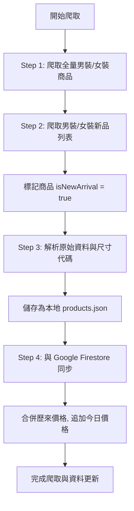

# 台灣 UNIQLO 商品歷史比價網 - 快速查價

本專案是一個針對台灣 UNIQLO 商品進行價格監控、歷史價格比對與追蹤的比價網。網站前端採用 React + Vite 構建，數據儲存與同步結合本地 JSON 快取與 Google Cloud Firestore，並配備一個極為穩健且具備反防爬防封鎖機制的後端爬蟲系統。

---

## 🌐 網站核心功能

### 1. 響應式 Header 與極簡導航
*   **一級與二級分類下拉選單 (桌面端)**：Header 提供「男裝 MENS」與「女裝 WOMENS」頁籤，滑鼠懸停時自動展示二級子分類下拉卡片（新品上市、限定價格、特價商品、上衣類、下裝類、外套類），並配合平滑的淡入位移視覺動畫。
*   **搜尋欄 focus 動態微交互**：桌面端搜尋框寬度預設為極簡的 `130px`，當點選準備輸入時會平滑擴展至 `200px`，移開焦點後自動恢復。搜尋 Icon 與清除按鈕均在垂直中心線上精準對齊。
*   **手機版 (RWD) 佈局優化**：當螢幕寬度 `≤768px` 時，Header 自動收縮為極簡雙元素佈局 — 搜尋框（佔 85% 寬度，可直接輸入）與漢堡選單 Icon（佔 15% 寬度）。其餘次要按鈕（如我的追蹤、安裝 PWA）自動移入抽屜 Drawer 內，完美優化手機用戶輸入體驗。
*   **手風琴式行動 Drawer**：行動端漢堡選單內，男、女裝子分類以 Accordion（手風琴折疊）形式呈現，支援流暢的二級展開。

### 2. 首頁三大精選區塊
當網頁處於預設狀態（無搜尋、無特定分類篩選）時，首頁會展現精心挑選的三大區塊：
1.  **🔥 熱門瀏覽 TOP 10**：展示該 session 中瀏覽次數前 10 高的熱門商品。
2.  **⚡ 男裝最新商品**：展示最新的男裝新品（前 10 件）。
3.  **✨ 女裝最新商品**：展示最新的女裝新品（前 10 件）。
*   每個精選區塊底部皆使用流暢的 **橫向滾動容器 (Horizontal snap-scroll)** 排版，在桌面與行動端均有極佳的手勢滑動感。
*   一旦用戶進行搜尋或點選了任何二級分類，網頁會自動切換為**平鋪商品列表模式**。

### 3. 商品瀏覽次數動態遞增
*   商品載入時，會依據商品編號自動計算一個 pseudo-random 的初始瀏覽數（100 ~ 999 之間）。
*   當用戶點擊任何商品開啟詳情 Modal 時，該商品的 `views` 在 React 狀態中自動 `+1`。並在詳情頁右側顯眼標註「👁️ X 次瀏覽」，關閉再打開或回到首頁皆會即時累加。

### 4. 歷史價格折線圖與最低價標籤
*   **智慧標籤與參考線**：如果該商品的價格在歷史記錄中有降價起伏，詳情頁下方會利用 Recharts 渲染歷史價格折線圖，並在地圖上繪製「歷史史低參考線」；商品名稱下方也會加上紅色的「歷史最低價」標記。
*   **條件排除邏輯**：如果該商品的價格數據**僅有 1 筆**，或者**歷史上記錄的每一筆價格都完全相同**，網站將自動隱藏「歷史最低價」促銷標誌，且折線圖中亦不會顯示最低價虛線參考線，以避免視覺干擾與邏輯錯誤。

### 5. 尺寸轉譯與缺貨提示
*   **尺碼範圍全展示**：商品詳情會自動找出有貨尺寸的最大與最小範圍（如 `XS ~ 3XL`），並將這個區間內的所有尺寸都列出來。
*   **無貨半透明刪除線**：若某個尺碼在官網上已無貨，該尺寸標籤不會消失，而是會顯示為**半透明灰底、加上刪除線且不允許點擊**，讓使用者一眼看出斷碼狀況。

---

## 🕷️ 後端爬蟲系統架構與邏輯

專案內的核心爬取腳本為 `crawl_all_men.cjs`。此爬蟲專為 UNIQLO 台灣官網量身打造，具備高度穩健的防封鎖與數據同步機制。

### 1. 爬取目標與 API 接口
*   **目標 API 接口**：`https://d.uniqlo.com/tw/p/search/products/by-category` (POST 請求)
*   **API Payload 參數**：
    ```json
    {
      "categoryCode": "分類代碼",
      "pageInfo": { "page": 1, "pageSize": 100 }
    }
    ```
*   **爬取分類代碼**：
    *   `all_men` (全部男裝)
    *   `all_women` (全部女裝)
    *   `feature-new-men` (男裝新品)
    *   `feature-new-women` (女裝新品)

### 2. 爬蟲執行流程


#### Step 1: 抓取全量商品與去重
*   發送 POST 請求獲取男裝與女裝全部分類商品，設定每頁抓取 100 件商品，依據第一頁返回的 `productSum` 自動計算總頁數並循環抓取。

#### Step 2: 標記新品上市 (New Arrivals)
*   分開請求 `feature-new-men` 與 `feature-new-women` 分類，如果抓到的商品已經在 Step 1 的資料中，則修改 `isNewArrival = true`。如果不在此列表中，則作為新品額外寫入數據集中。

#### Step 3: 資料清洗與尺碼/促銷轉譯
*   **促銷標籤解析**：
    *   檢查 `identity` 欄位是否包含 `concessional_rate`，若是則貼上 **「特價商品」** 標籤。
    *   比對當前時間與官網的 `timeLimitedBegin` 和 `timeLimitedEnd`，若在此時間區間內，則加上 **「截至 MM/DD 限定價格」** 標籤。
*   **尺寸代碼轉譯**：官網獲取的尺碼均為代碼，爬蟲與前端在展示時會進行以下解析與翻譯：
    *   `SMA001` ~ `SMA009` ➡️ `XXS` ~ `4XL`
    *   `WSC023` / `MSC023` ➡️ `23~25cm`
    *   `MSC025` ➡️ `25~27cm`
    *   `MSC027` ➡️ `27~29cm`
    *   `SIZ999` ➡️ `ONE SIZE`
    *   `CMDxxx`（如 `CMD070`）➡️ `70cm` (以此類推)
    *   `INSxxx`（如 `INS021`）➡️ `21inch` (以此類推)

#### Step 4: 歷史價格合併與 Firestore 同步
*   腳本從本地 `.env` 檔載入 Firebase Cloud Firestore 設定，初始化 Firebase App。
*   針對每一件爬取到的商品，爬蟲會先讀取 Firestore 中已存在的商品文檔：
    *   若文檔存在且已包含 `historyPrices` 歷史價格陣列，爬蟲會將歷史陣列讀出。
    *   比對今日日期，若今日尚未記錄，則將今日的售價追加進 `historyPrices`；若今日已記錄但售價發生了變動，則更新今日的價格紀錄。
    *   這確保了在多次爬取中，歷史比價線（historyPrices）能夠隨時間推移記錄下每日價格波動。
*   將更新後的完整資料通過 `setDoc` 回寫至 Firestore，同時備份至本地的 `src/data/products.json` 以供離線快取使用。

### 3. 反爬蟲封鎖機制 (Anti-Bot Measures)
為避免觸發 UNIQLO 官網的防火牆或流量管制限制，爬蟲整合了以下措施：
*   **隨機 User-Agent**：每次分頁請求會隨機從常見的 Windows, macOS, Linux 瀏覽器頭部資訊（User-Agent 清單）中輪詢切換。
*   **隨機延遲**：每爬取一頁商品，會進行 `800ms` 至 `1500ms` 的隨機睡眠延遲，模擬真人瀏覽。
*   **批次暫停**：每爬取 3 頁商品，會觸發批次額外休息 `3000ms`；在男裝、女裝等大分類切換時，也會暫停休息 `3000ms`。
*   **429 流量管制自動重試**：當 API 返回 HTTP 429 Too Many Requests 狀態碼時，腳本會自動暫停，並以 **`重試次數 * 5 秒`** 的指數退避機制進行休眠等待，休眠結束後自動重新發送請求，確保爬蟲任務不因短暫的限流而中斷。

---

## 🛠️ 開發與部署運行

### 1. 安裝依賴項
```bash
npm install
```

### 2. 環境變數配置 (.env)
在專案根目錄下建立 `.env` 檔案（可參考 `.env.example`），並配置 Firebase 金鑰：
```env
VITE_FIREBASE_API_KEY=您的金鑰
VITE_FIREBASE_AUTH_DOMAIN=您的專案網域
VITE_FIREBASE_PROJECT_ID=您的專案ID
VITE_FIREBASE_STORAGE_BUCKET=您的儲存桶名稱
VITE_FIREBASE_MESSAGING_SENDER_ID=您的傳送者ID
VITE_FIREBASE_APP_ID=您的AppID
```

### 3. 運行網頁 (本地開發)
```bash
npm run dev
```
或在 Windows 系統下直接雙擊執行目錄下的 `啟動器.bat`。

### 4. 運行爬蟲 (手動更新數據與比價)
```bash
node crawl_all_men.cjs
```
