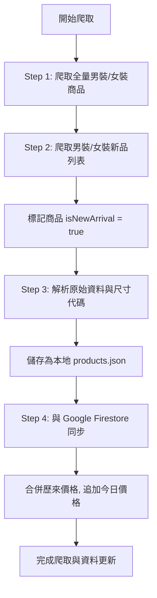

# 台灣 UNIQLO 商品歷史比價網 - 快速查價

本專案是一個針對台灣 UNIQLO 商品進行價格監控、歷史價格比對與追蹤的比價網。網站前端採用 React + Vite 構建，數據儲存與同步結合本地 JSON 快取與 Google Cloud Firestore，並配備一個極為穩健且具備反防爬防封鎖機制的後端爬蟲系統。

---

## 🚀 2026-06-24 重大更新與迭代日誌

本專案在 2026-06-24 進行了一次全面的架構升級與優化，涵蓋前端 UI/UX、後台安全、資料庫效能及自動化部署等多個面向：

### 1. ⚙️ Firestore 讀寫分離與加載效能優化
*   **商品與歷史價格分流**：將原先商品文檔中的巨大 `historyPrices` 歷史價格陣列分離，以商品 ID 為主鍵獨立儲存於 `product_prices` 集合。
*   **按需載入 (On-demand Load)**：前端首頁僅載入 `products` 集合，去除了體積龐大的歷史價格，使初次載入頻寬與渲染開銷降低 90% 以上。當使用者點擊商品開啟 Modal 詳情時，才非同步調用 `getDoc` 載入其價格歷史繪製折線圖。

### 2. ⚡ 爬蟲同步機制重構 (增量與批次寫入)
*   **MD5 Hash 差異比對**：爬蟲寫入前會比對 API 數據與資料庫現有數據的雜湊值，無異動則 Skip 更新，節省 80%~90% 的 Firestore 寫入次數。
*   **批次寫入 (Write Batch)**：改用 Firestore 批次提交，每 400 筆商品自動進行 Commit，避免大量單次寫入導致超時與效能瓶頸。
*   **下架狀態自動管理**：比對資料庫現存 active 商品與本次抓取資料，若官網已下架，自動將商品 active 設為 `false`，狀態改為 `expired`，不直接刪除以保留歷史價格。
*   **期間限定商品索引**：將特價商品彙整寫入獨立的快速索引文檔 `campaign_products/current`。
*   **同步日誌記錄**：每次同步完成會自動向 `system/sync_logs_YYYYMMDD` 寫入本次同步統計日誌。

### 3. 🛡️ 獨立管理員後台與安全防護
*   **隱藏後台路由 `/admin`**：首頁完全隱藏後台管理按鈕，必須手動訪問 `/admin` 進入。
*   **登入保護**：提供管理員登入（預設帳密：`admin` / `admin123`），狀態存於 `sessionStorage` 避免刷頁登出。
*   **版本刪除功能**：後台版本列表提供「刪除」按鈕，確認後可從資料庫刪除，頁尾版本號會即時回退。
*   **「返回首頁」按鈕**：登入頁面與 Header 中均配置了清晰的返回首頁按鈕。

### 4. 🔄 即時監聽與 Service Worker 防快取
*   **Firestore 即時監聽**：首頁商品與版本列表全面改用 `onSnapshot` 進行即時監聽，數據一有變動（如價格更新、發布/刪除版本）即時渲染。
*   **PWA 網路優先策略 (Network-First)**：Service Worker 改為網路優先，確保使用者每次都能載入最新的前端程式碼，避免本地舊快取干擾。

### 5. 🏷️ 尺寸代碼正則轉譯
*   **兒童與嬰幼兒尺寸轉譯**：支持自動匹配 `CMC110` / `CMA80` / `CMB70` 等格式，正則表達式會自動提取後方數字轉譯為 `110cm` / `80cm` / `70cm`，使童裝尺碼更直覺。

### 6. 📅 GitHub Actions 每周自動爬蟲
*   **排程定時執行**：配置 `.github/workflows/crawl.yml`，定於每週四早上 **08:55（台灣時間）** 自動在 GitHub 雲端環境中啟動爬蟲同步，並支持手動觸發。

---


## 🌐 網站核心功能

### 1. 響應式 Header 與極簡導航
*   **一級與二級分類下拉選單 (桌面端)**：Header 提供「男裝 MENS」與「女裝 WOMENS」頁籤，滑鼠懸停時自動展示二級子分類下拉卡片（新品上市、限定價格、特價商品、上衣類、下裝類、外套類），並配合平滑的淡入位移視覺動畫。
*   **搜尋欄 focus 動態微交互**：桌面端搜尋框寬度預設為極簡的 `130px`，當點選準備輸入時會平滑擴展至 `200px`，移開焦點後自動恢復。搜尋 Icon 與清除按鈕均在垂直中心線上精準對齊。
*   **手機版 (RWD) 佈局優化**：當螢幕寬度 `≤768px` 時，Header 自動收縮為極簡雙元素佈局 — 搜尋框（佔 85% 寬度，可直接輸入）與漢堡選單 Icon（佔 15% 寬度）。其餘次要按鈕（如我的追蹤、安裝 PWA）自動移入抽屜 Drawer 內，完美優化手機用戶輸入體驗。
*   **手風琴式行動 Drawer**：行動端漢堡選單內，男、女裝子分類以 Accordion（手風琴折疊）形式呈現，支援流暢的二級展開。

### 2. 獨立管理員後台與版本日誌管理
*   **隱藏後台入口與 `/admin` 路由**：首頁與選單中已不顯示後台管理按鈕，改為透過獨立路由 `/admin` 手動造訪。未登入時會顯示精美的管理員登入頁面（帳密為 `admin` / `admin123`），登入狀態存於 `sessionStorage`，防止刷頁登出。
*   **版本管理與刪除功能**：支援重大改版、新增功能、修復優化的版本日誌發布，當前最新版本會即時顯示於最底層頁尾。後台版本列表提供「刪除」功能，點擊確認後可從 Firestore 刪除並即時降回前一版本號。
*   **「返回首頁」捷徑**：後台登入頁與 Header 中均配置了「返回首頁」按鈕，點擊後能重新載回查價首頁。

### 3. 即時資料同步 (Real-time Sync) 與防快取機制
*   **Firestore 即時監聽**：首頁商品與版本歷史拋棄本機 JSON 快取，全面使用 `onSnapshot` 與資料庫同步。數據一經變更（如發布或刪除版本、價格更新）將即時渲染至畫面。
*   **PWA 網路優先策略 (Network-First)**：將 Service Worker 的靜態檔案快取策略改為網路優先。有網路時，網頁一律存取伺服器上最新的 HTML、CSS 與 JS，防止因本地 Service Worker 快取舊代碼而看不見最新功能更新。

### 4. 首頁三大精選區塊
當網頁處於預設狀態（無搜尋、無特定分類篩選）時，首頁會展現精心挑選的三大區塊：
1.  **🔥 熱門瀏覽 TOP 10**：展示該 session 中瀏覽次數前 10 高的熱門商品。
2.  **⚡ 男裝最新商品**：展示最新的男裝新品（前 10 件）。
3.  **✨ 女裝最新商品**：展示最新的女裝新品（前 10 件）。
*   每個精選區塊底部皆使用流暢的 **橫向滾動容器 (Horizontal snap-scroll)** 排版，在桌面與行動端均有極佳的手勢滑動感。
*   一旦用戶進行搜尋或點選了任何二級分類，網頁會自動切換為**平鋪商品列表模式**。

### 3. 商品瀏覽次數動態遞增
*   商品載入時，會依據商品編號自動計算一個 pseudo-random 的初始瀏覽數（100 ~ 999 之間）。
*   當用戶點擊任何商品開啟詳情 Modal 時，該商品的 `views` 在 React 狀態中自動 `+1`。並在詳情頁右側顯眼標註「👁️ X 次瀏覽」，關閉再打開或回到首頁皆會即時累加。

### 4. 歷史價格折線圖與最低價標籤
*   **智慧標籤與參考線**：如果該商品的價格在歷史記錄中有降價起伏，詳情頁下方會利用 Recharts 渲染歷史價格折線圖，並在地圖上繪製「歷史史低參考線」；商品名稱下方也會加上紅色的「歷史最低價」標記。
*   **條件排除邏輯**：如果該商品的價格數據**僅有 1 筆**，或者**歷史上記錄的每一筆價格都完全相同**，網站將自動隱藏「歷史最低價」促銷標誌，且折線圖中亦不會顯示最低價虛線參考線，以避免視覺干擾與邏輯錯誤。

### 5. 尺寸轉譯與缺貨提示
*   **尺碼範圍全展示**：商品詳情會自動找出有貨尺寸的最大與最小範圍（如 `XS ~ 3XL`），並將這個區間內的所有尺寸都列出來。
*   **無貨半透明刪除線**：若某個尺碼在官網上已無貨，該尺寸標籤不會消失，而是會顯示為**半透明灰底、加上刪除線且不允許點擊**，讓使用者一眼看出斷碼狀況。

---

## 🕷️ 後端爬蟲系統架構與邏輯

專案內的核心爬取腳本為 `crawl_all_men.cjs`。此爬蟲專為 UNIQLO 台灣官網量身打造，具備高度穩健的防封鎖與數據同步機制。

### 1. 爬取目標與 API 接口
*   **目標 API 接口**：`https://d.uniqlo.com/tw/p/search/products/by-category` (POST 請求)
*   **API Payload 參數**：
    ```json
    {
      "categoryCode": "分類代碼",
      "pageInfo": { "page": 1, "pageSize": 100 }
    }
    ```
*   **爬取分類代碼**：
    *   `all_men` (全部男裝)
    *   `all_women` (全部女裝)
    *   `feature-new-men` (男裝新品)
    *   `feature-new-women` (女裝新品)

### 2. 爬蟲執行流程


#### Step 1: 抓取全量商品與去重
*   發送 POST 請求獲取男裝與女裝全部分類商品，設定每頁抓取 100 件商品，依據第一頁返回的 `productSum` 自動計算總頁數並循環抓取。

#### Step 2: 標記新品上市 (New Arrivals)
*   分開請求 `feature-new-men` 與 `feature-new-women` 分類，如果抓到的商品已經在 Step 1 的資料中，則修改 `isNewArrival = true`。如果不在此列表中，則作為新品額外寫入數據集中。

#### Step 3: 資料清洗與尺碼/促銷轉譯
*   **促銷標籤解析**：
    *   檢查 `identity` 欄位是否包含 `concessional_rate`，若是則貼上 **「特價商品」** 標籤。
    *   比對當前時間與官網的 `timeLimitedBegin` 和 `timeLimitedEnd`，若在此時間區間內，則加上 **「截至 MM/DD 限定價格」** 標籤。
*   **尺寸代碼轉譯**：官網獲取的尺碼均為代碼，爬蟲與前端在展示時會進行以下解析與翻譯：
    *   `SMA001` ~ `SMA009` ➡️ `XXS` ~ `4XL`
    *   `WSC023` / `MSC023` ➡️ `23~25cm`
    *   `MSC025` ➡️ `25~27cm`
    *   `MSC027` ➡️ `27~29cm`
    *   `SIZ999` ➡️ `ONE SIZE`
    *   `CMDxxx`（如 `CMD070`）➡️ `70cm` (以此類推)
    *   `INSxxx`（如 `INS021`）➡️ `21inch` (以此類推)
    *   **兒童與嬰幼兒尺寸代碼轉譯**：支持自動匹配 `CMC110` / `CMA80` / `CMB70` 等格式，正則表達式會自動提取後方數字轉譯為 `110cm` / `80cm` / `70cm`，使童裝尺碼更加直覺易讀。

#### Step 4: 增量 Hash 比對與價格分流同步
*   **圖片路徑相對化**：為大幅精簡 Firestore 的儲存 Byte 大小，爬蟲僅儲存相對路徑（如 `/support/img/...`），前端渲染時再動態拼接官網 Base URL 前綴。
*   **移除空值與 redundant 欄位**：寫入前會自動過濾除掉所有 `null` 或 `undefined` 屬性，並不寫入重複的 `sizes` 欄位，全站統一改用單數的 `size` 欄位以優化 NoSQL 存儲空間。
*   **MD5 Hash 差異比對 (增量寫入)**：寫入前先比對 API 商品物件雜湊值與 Firestore 原存雜湊值，無異動則 **Skip (跳過更新)**，僅有變動時才更新，**可節省高達 80%~90% 的寫入費用**。
*   **下架狀態自動管理**：載入資料庫原 active 商品列表比對，若本次爬蟲未抓到，將以 Firestore 批量操作自動將該商品的 active 設為 `false`，狀態設為 `expired`，不直接刪除，以便保留歷史價格。
*   **商品與歷史價格分流 (讀寫分離)**：
    *   商品主資訊寫入 `products` 集合，不包含巨大的歷史價格陣列，首頁加載體積精簡了 90% 以上。
    *   歷史價格 `historyPrices` 陣列獨立寫入 `product_prices` 集合（文件 ID 即商品 ID）。
    *   爬蟲寫入前會自動預先計算該價格今日是否為「歷史最低價」並存入 boolean 屬性 `isHistoricalLowest: true/false`。
    *   前端首頁載入時僅讀取主商品集合；當使用者點擊商品開啟 Modal 詳情時，才非同步調用 `getDoc(doc(db, 'product_prices', id))` 載入該商品價格歷史並繪製折線圖。
*   **寫入性能優化**：改用 **Firestore Batch Write**，每 400 筆商品自動進行一次批次提交寫入，防止逾時。
*   **期間限定商品索引與日誌**：同步完成後彙整期間限定特價商品至快速索引文檔 `campaign_products/current`，並向 `system/sync_logs_YYYYMMDD` 寫入本次同步統計日誌。

### 3. 反爬蟲封鎖機制 (Anti-Bot Measures)
為避免觸發 UNIQLO 官網的防火牆或流量管制限制，爬蟲整合了以下措施：
*   **隨機 User-Agent**：每次分頁請求會隨機從常見的 Windows, macOS, Linux 瀏覽器頭部資訊（User-Agent 清單）中輪詢切換。
*   **隨機延遲**：每爬取一頁商品，會進行 `800ms` 至 `1500ms` 的隨機睡眠延遲，模擬真人瀏覽。
*   **批次暫停**：每爬取 3 頁商品，會觸發批次額外休息 `3000ms`；在男裝、女裝等大分類切換時，也會暫停休息 `3000ms`。
*   **429 流量管制自動重試**：當 API 返回 HTTP 429 Too Many Requests 狀態碼時，腳本會自動暫停，並以 **`重試次數 * 5 秒`** 的指數退避機制進行休眠等待，休眠結束後自動重新發送請求，確保爬蟲任務不因短暫的限流而中斷。

---

## 🛠️ 開發與部署運行

### 1. 安裝依賴項
```bash
npm install
```

### 2. 環境變數配置 (.env)
在專案根目錄下建立 `.env` 檔案（可參考 `.env.example`），並配置 Firebase 金鑰：
```env
VITE_FIREBASE_API_KEY=您的金鑰
VITE_FIREBASE_AUTH_DOMAIN=您的專案網域
VITE_FIREBASE_PROJECT_ID=您的專案ID
VITE_FIREBASE_STORAGE_BUCKET=您的儲存桶名稱
VITE_FIREBASE_MESSAGING_SENDER_ID=您的傳送者ID
VITE_FIREBASE_APP_ID=您的AppID
```

### 3. 運行網頁 (本地開發)
```bash
npm run dev
```
或在 Windows 系統下直接雙擊執行目錄下的 `啟動器.bat`。

### 4. 運行爬蟲 (手動更新數據與比價)
```bash
node crawl_all_men.cjs
```

### 5. 每週自動排程爬蟲 (GitHub Actions)
專案已配置 GitHub 工作流 [.github/workflows/crawl.yml](file:///c:/Users/jacky/OneDrive/Desktop/UNIQLO/.github/workflows/crawl.yml)。
* **自動執行**：每週四早上 **08:55（台灣時間）** 自動在 GitHub 雲端環境中啟動爬蟲，執行增量爬取與 Firestore 資料庫同步。
* **手動執行**：支援 `workflow_dispatch`，可在 GitHub 專案的 **Actions** 頁面手動點選 **Run workflow** 隨時更新。
* **GitHub Repository Secrets 配置**：
  請至您的 GitHub Repository 點選 `Settings` > `Secrets and variables` > `Actions` > `New repository secret`，新增以下 6 個環境變數（值請照您的 `.env` 檔案內填寫）：
  * `VITE_FIREBASE_API_KEY`
  * `VITE_FIREBASE_AUTH_DOMAIN`
  * `VITE_FIREBASE_PROJECT_ID`
  * `VITE_FIREBASE_STORAGE_BUCKET`
  * `VITE_FIREBASE_MESSAGING_SENDER_ID`
  * `VITE_FIREBASE_APP_ID`
